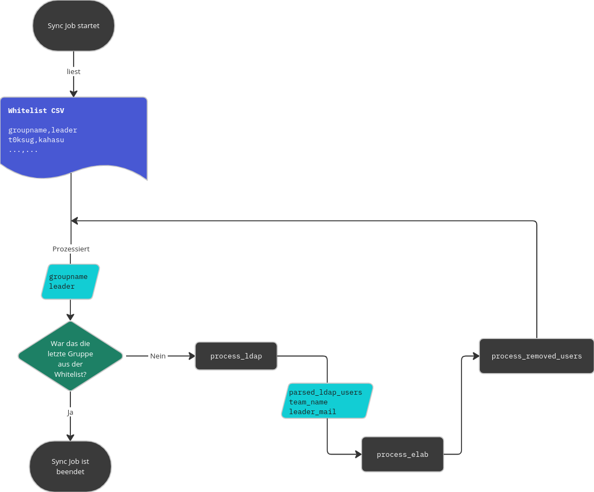

# elabFTW LDAP Sync Script

This Script reads groupnames and user-IDs from a CSV file, queries an Identity Provider (LDAP) for all users of a given group and adds the users to the team LDAP, creating them if they don't exist yet:



It *does not* create the team in LDAP. This is a design decision to be in manual control of the process and could easily be implemented as the elabFTW API supports this.

The Script will archive users (and put them in a team called `userarchiv`) in elabFTW that were in a team in elabFTW once but are not members of the team in LDAP anymore. It is also capable of un-archiving users when they are added back again in LDAP.

## Setup

Build Prerequisites for LDAP: https://www.python-ldap.org/en/python-ldap-3.3.0/installing.html#alpine

```
apk add build-base openldap-dev python3-dev
```

### Run the script locally

1. Get API Key in elabFTW: https://your-elab-instance.com/ucp.php?tab=4
2. Copy the `.env.example` file to `.env` and fill in your data (or use any other means to provide the needed environment variables)
3. Provide a CSV List of groups in the folder you are running the script from (see `group_whitelist.csv` for an example)
4. Set up a virtual Environment and install dependencies with pipen:
    ```bash
    pipenv install --dev
    pipenv shell
    ```
5. Create a team called `userarchiv` in the elabFTW instance
6. Create the team(s) defined in the `group_whitelist.csv` in elabFTW where elabFTW `orgid` needs to match the name you defined in the CSV file.
7. run the script: `elabftw`
   


## Adapt the script to use any Identity Provider other than LDAP

In the `for` loop that goes over each group read from the CSV whitelist in the `main.py/start_sync()` function, LDAP is queried to return all members of the group:

```python
ldap_users, leader_mail = process_ldap(
   ld,
   LDAP_BASE_DN,
   LDAP_SEARCH_GROUP.format(groupname=group["groupname"]),
   LDAP_SEARCH_USER_ATTRS.split(","),
   group["leader"],
)
```

replace this with custom code to output something like:

```
[
   {
      "email": "max.mustermann@uni-muenster.de",
      "firstname": "Max",
      "lastname": "Mustermann",
      "uni_id": "m_muster01",
   },
   {
      "email": "eva.beispiel@uni-muenster.de",
      "firstname": "Eva",
      "lastname": "Beispiel",
      "uni_id": "e_beisp02",
   },
]
```

for `ldap_users` and a string for `leader_mail`.

## CLI option to define a custom CSV Whitelist

If not called with `elabus --whitelist /path/to/csv` the script will look for the environment variable `WHITELIST_FILENAME` to determine the path of the CSV to read or default to `group_whitelist.csv` in the folder the script is run from.